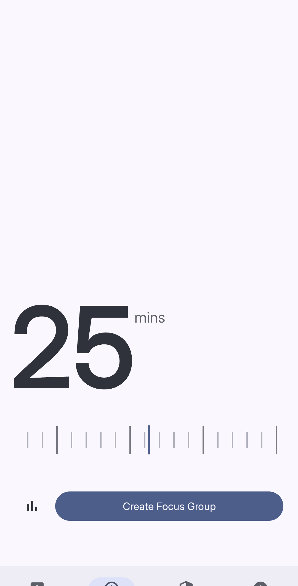
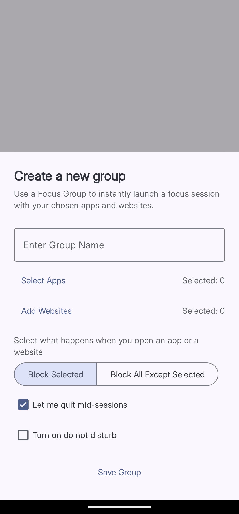
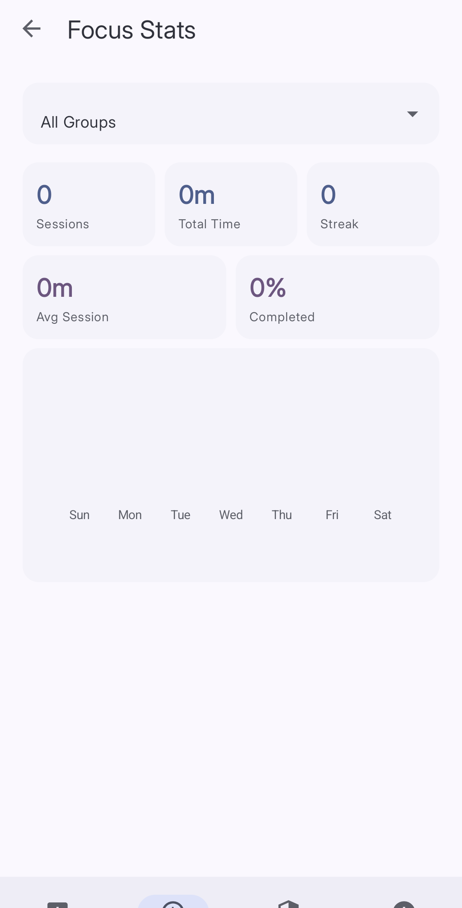

import { Steps, Aside } from '@astrojs/starlight/components';

Focus Mode lets you start a timed session where Curbox blocks your chosen apps and websites. When the timer runs out, everything goes back to normal. It is perfect for study sessions, deep work, or any time you want to concentrate without fighting the urge to check your phone.

## How It Works

You set a session length using the slider on the **Focus** tab. Then you pick a **Focus Group** — a saved list of apps and websites to block or allow during the session. Tap to start and Curbox takes over.

*Drag the scrubber to set your session length.*

## Creating a Focus Group

A Focus Group is a preset you save once and reuse anytime. You can have as many groups as you like.

*The group setup sheet — fill in the details and tap Save Group.*

<Steps>
1. **Open the Focus tab**
   Tap **Focus** in the bottom navigation bar.

2. **Tap Create Focus Group**
   This opens the group setup sheet.

3. **Enter a name**
   Type a name in the **Enter Group Name** field. Call it something that reminds you what it is for, like "Work" or "Reading."

4. **Select apps**
   Tap **Select Apps** and choose the apps this group affects.

5. **Add websites** (optional)
   Tap **Add Websites** and type any website addresses or keywords you want to include.

6. **Choose a block mode**
   Select one of the two options:
   - **Block Selected** — blocks only the apps and websites you chose.
   - **Block All Except Selected** — blocks everything except the apps and websites you chose.

7. **Set extra options** (optional)
   - Toggle **Let me quit mid-sessions** on if you want to be able to end the session even if it's incomplete.
   - Toggle **Turn on do not disturb** on if you want your phone to silence notifications during the session.

8. **Tap Save Group**
   Your group is saved and ready to use.
</Steps>

## Starting a Session

<Steps>
1. **Set the timer**
   Drag the slider on the **Focus** tab to pick your session length in minutes.

2. **Choose your group**
   Select an existing group from the dropdown, or tap **Create Focus Group** to make a new one.

3. **Start**
   Tap the confirm button. Curbox activates your group for the duration you set.
</Steps>

<Aside type="tip">
Start with 25 minutes. It is long enough to get something done but short enough to feel manageable. You can always go longer once it feels comfortable.
</Aside>

## Focus Stats

Tap the bar chart icon next to the session slider to open **Focus Stats**. You can see your total sessions, total focus time, average session length, completion rate, and your current day streak. Use the dropdown at the top to filter by group.

*Focus Stats — all your session data in one place.*
