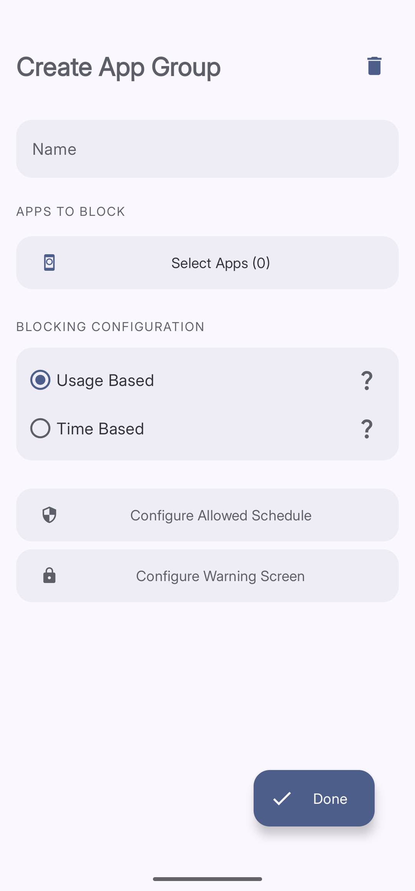
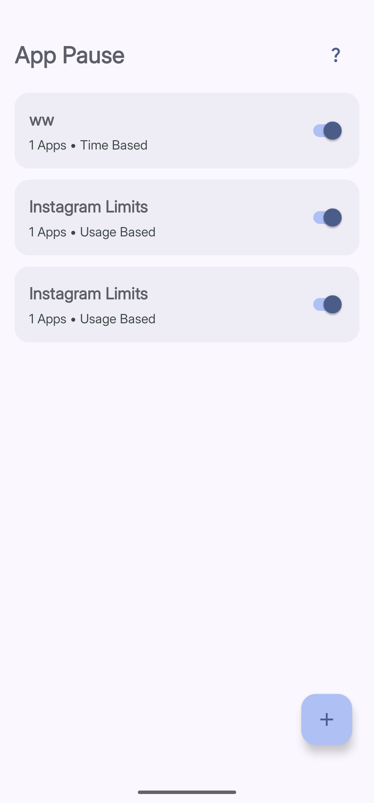

import { Steps, Aside } from '@astrojs/starlight/components';

**App Pause** lets you set limits on any app. When you hit your limit, Curbox shows a pause screen. You decide what happens on that screen — whether you can proceed, how long for, and what effort it takes to get through.

<Aside type="tip">
The main difference is that Focus Mode is designed to quickly block apps for a specific duration, whereas App Pause is intended for running automated daily schedules.
</Aside>

## Blocking Modes

When you create an App Pause group, you choose one of two blocking modes.

| Mode | How it works |
|---|---|
| **Usage Based** | Tracks how long you use the app each day. Blocks when you hit your daily limit. |
| **Time Based** | Allow apps the app to be used between only specific time window, like 10 PM to 7 AM every night. |
| **On each open** | Block the app each time you open it irrepective of time or usage. |

## Creating a Group

*The group creation screen — name your group, pick apps, and choose a blocking mode.*

<Steps>
1. **Open App Pause**
   Tap **Reducers** in the bottom navigation bar, then tap **Apps**.

2. **Tap the + button**
   The **+** button is in the bottom right corner of the screen. Tap it to open **Create App Group**.

3. **Enter a name**
   Type a name in the **Name** field. Something clear like "Instagram" or "Social Media" works well.

4. **Select apps**
   Tap **Select Apps** and choose the apps you want to include in this group.

5. **Choose a blocking mode**

6. **Set your schedule**:
   Tap **Configure Allowed Schedule** to set which hours or days this limit is active. For example, you could allow the app in the evenings but block it during work hours.

7. **Configure the warning screen** (optional)
   Tap **Configure Warning Screen** to choose what happens when the block triggers. See [Unlock Challenges](BASE_URL/unlock-challenges/overview) for the full guide.

8. **Tap Done**
   Your group is saved and active immediately.
</Steps>

<Aside type="caution">
The app can't cross midnight in a single schedule for time based block. For an overnight block like 11 PM to 2 AM, just make two separate blocks: 11 PM to 12 AM, and 12 AM to 2 AM.
</Aside>

<Aside type="tip">
Start with **Usage Based** if you are not sure which mode to pick. Check the **Usage** tab first to see your current daily average, then set your limit a little below that. Working toward a realistic target is much easier than starting too strict.
</Aside>

## Managing Your Groups

The **App Pause** screen shows all your groups in a list. Each card shows the group name, how many apps are in it, and which mode it uses.

*Each card is one group. Toggle the switch to pause or resume a group without deleting it.*

Toggle the switch on any card to turn that group on or off without deleting it.

# Combining App Blocker Rules

The real power of Curbox comes from stacking multiple groups on the same app. This page shows every way you can combine them and what each combination actually does.

Always read [Unlock Challenges](BASE_URL/unlock-challenges/overview) before you read this section.

---

## Two different rule types on the same app

You can add the same app to two groups as long as each group uses a different rule type. Curbox checks both rules every time you open that app.

This works for:
- One Timed group and one Usage group on the same app
- One Timed group and one On Open group on the same app

It does not work for:
- Two Usage groups on the same app (only the last one you set up will count)
- Two Timed groups on the same app (same issue)

---

## "Only between 6 PM and 9 PM, and only for 1 hour"

This is one of the most useful combinations you can make. Here is exactly how to set it up.

**Step 1: Create a Timed group**

1. Open App Blocker
2. Tap **New Group**
3. Give it a name like "Instagram Evening Only"
4. Choose **Timed** as the rule type
5. Add Instagram to the app list
6. Set the allowed window to 6:00 PM through 9:00 PM
7. Save

This group alone makes Instagram completely unavailable before 6 PM and after 9 PM.

**Step 2: Create a Usage group**

1. Tap **New Group** again
2. Name it "Instagram Time Cap"
3. Choose **Usage** as the rule type
4. Add Instagram to the app list
5. Set the daily limit to 60 minutes
6. Save

Both groups are now active at the same time.

**What this looks like each day:**

You pick up your phone at 2 PM and open Instagram. Curbox closes it immediately because the Timed group says it is not time yet.

At 7 PM you open it again. Curbox lets you in. You use it for 45 minutes and put the phone down.

At 8 PM you pick it back up and try again. Curbox lets you in for 15 more minutes, then closes it. You have used up your hour.

You try one more time at 8:30 PM. Curbox closes it because the Usage group has no time left, even though the Timed group would normally allow it.

Tomorrow at midnight the usage counter resets, and you get another hour inside the 6 PM to 9 PM window.

---
---

## "Social apps blocked on weekdays, limited on weekends"

Group A (Timed, applied to Instagram, TikTok, and Twitter):
- Allowed only on Saturday and Sunday

Group B (Usage, applied to Instagram only):
- 45 minutes per day (applies on the days the Timed group allows it)

Group C (Usage, applied to TikTok only):
- 20 minutes per day

Group D (On Open, applied to Twitter):
- No exceptions, even on weekends

What this does:
- Monday through Friday: all three apps are closed by the Timed group.
- Saturday and Sunday: Twitter is still closed (On Open overrides everything). Instagram gives you 45 minutes. TikTok gives you 20 minutes.

The apps in different groups are tracked completely independently. Instagram's 45 minute timer has nothing to do with TikTok's 20 minute timer.

---

## "Different limits on different days of the week"

When creating a Usage group, you can turn off the uniform setting and set a different number of minutes for each day.

Common setups:
- Weekdays: 15 minutes. Weekends: 1 hour.
- Monday through Thursday: 20 minutes. Friday: 60 minutes. Saturday and Sunday: 90 minutes.
- All days the same except Sunday where the limit is 0 (fully blocked).

You can combine this with a Timed group too. The Timed group can allow the app during a window, and the Usage group within that window caps your total time.

---

## "Block the app outside work hours, and limit it during work hours too"

This is a less common setup but works fine.

Timed group (blocked outside 9 AM to 5 PM):
The app is closed all night and on weekends if you do not add weekend windows.

Usage group (30 minutes per day):
Even during the work hours window, you only get 30 minutes total.

In practice this means the app is only available between 9 AM and 5 PM, and within that window you have 30 minutes before it closes.

---
