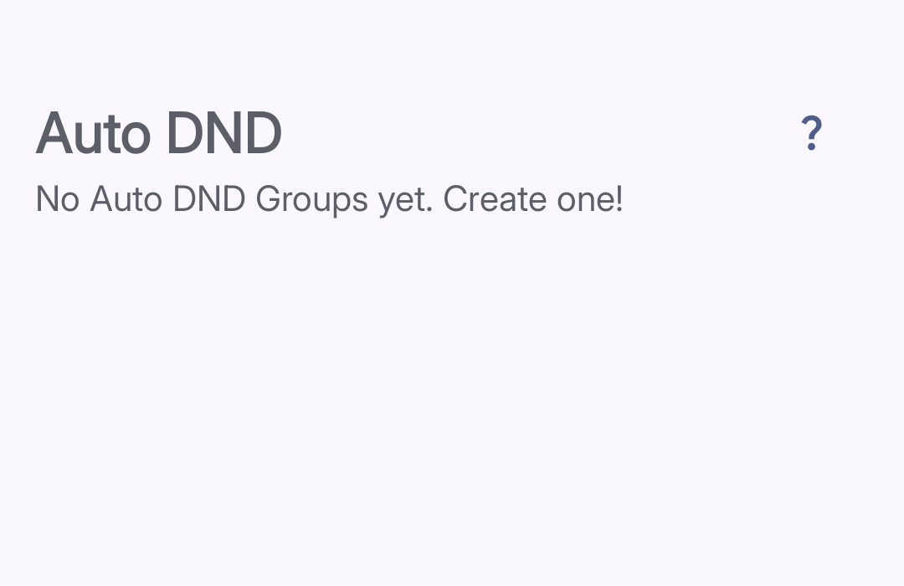

import { Steps, Aside } from '@astrojs/starlight/components';

**Auto DND** silences your notifications according to the time schedule you set.

## Setting It Up

*Tap the + button to add your first group.*

<Steps>
1. **Open Auto DND**
   Tap **Reducers**, then tap **Auto DND**.

2. **Tap the + button**
   The **+** button is in the bottom right corner.

3. **Name your group**
   Type a name for this group, like "Social Apps" or "Evening Browsing."

4. **Select Time Schedule**

5. **Save**
   Tap **Done**. Auto DND is now active for those apps.
</Steps>

<Aside type="caution">
The app can't cross midnight in a single time range. For an overnight time range like 11 PM to 2 AM, just make two separate blocks: 11 PM to 12 AM, and 12 AM to 2 AM.
</Aside>