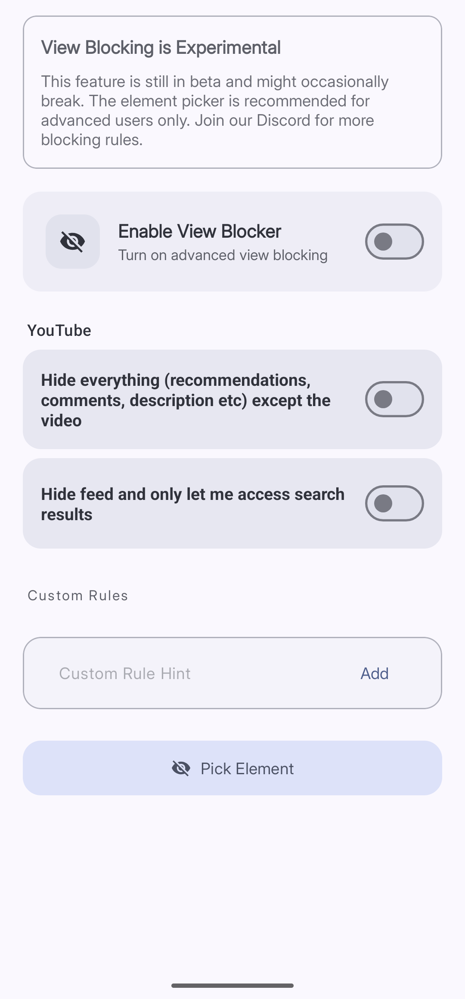

import { Aside } from '@astrojs/starlight/components';

**Hide UI Elements** removes specific parts of an app from your screen. Things like the YouTube recommendation feed, Reddit's home feed, or the "For You" tab on X. The app stays open and usable — only the parts you have targeted disappear.

<Aside type="caution">
This feature is experimental and still in beta. It may occasionally break or behave unexpectedly. The built-in rules are the easiest place to start.
</Aside>

## Enabling Hide UI Elements

Tap **Reducers**, then tap **Hide UI Elements**. Toggle on **Enable View Blocker** at the top of the screen.

*Built-in rules appear for any supported app that is installed on your device.*

## Built-In Rules

Curbox comes with ready-to-use rules for popular apps. A rule only appears on your screen if that app is installed on your device.

### YouTube

| Rule | What it hides |
|---|---|
| Hide everything except the video | Removes recommendations, comments, and the description below the player |
| Hide feed and only let me access search results | Hides the home feed so only search results are visible |

### Reddit

| Rule | What it hides |
|---|---|
| Hide home feed but let me access custom feeds | Hides the default home feed so you only see feeds you have specifically subscribed to |

### X (Twitter)

| Rule | What it hides |
|---|---|
| Hide "For You" and only let me access the Following tab | Removes the algorithmic feed and shows only people you follow |

Toggle on the rules you want. Each one works independently.

## Custom Rules

If none of the built-in rules cover what you need, you can write your own. Tap **Pick Element** to use the interactive picker — tap any part of any app and Curbox will try to identify it as a target. Custom rules are for advanced users. Join the Curbox Discord if you need help building one.
