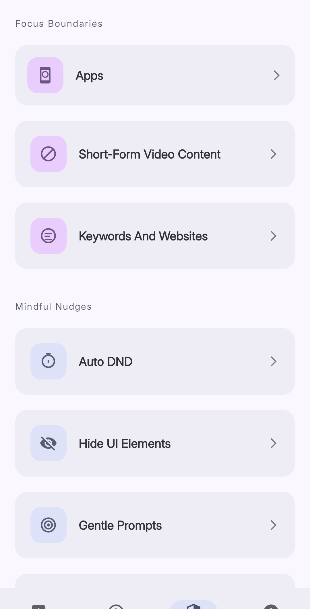
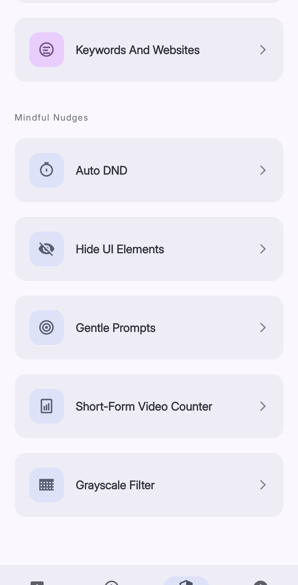

**Reducers** are the tools that make apps less addictive. You find them all in the **Reducers** tab at the bottom of the screen. Each reducer targets a different type of distraction, and you can use as many or as few as you like.

*The Reducers tab — scroll down to see all available tools.*

## Focus Boundaries

These tools actively block or limit access to apps and content.

| Reducer | What it does |
|---|---|
| **Apps** | Pauses specific apps after a usage limit or on a set schedule |
| **Short-Form Video Content** | Stops reels and shorts after a time limit or a video count |
| **Keywords And Websites** | Blocks websites that contain keywords you choose, across supported browsers |

## Mindful Nudges

These tools slow you down without fully blocking anything.

| Reducer | What it does |
|---|---|
| **Auto DND** | Turns on Do Not Disturb automatically when you open certain apps |
| **Hide UI Elements** | Hides distracting parts of apps, like feeds and comment sections |
| **Gentle Prompts** | Shows a message you wrote to yourself when you open a chosen app |
| **Short-Form Video Counter** | Displays a live count of how many short videos you have scrolled through today |
| **Grayscale Filter** | Turns your screen gray when you open certain apps |

## Where to Start

If you are new to Curbox, start with **Apps** and set a limit on the app you use most. Once that feels easy, add one more reducer at a time.

Trying to change everything at once rarely works. Small changes, done consistently, are what actually stick.
