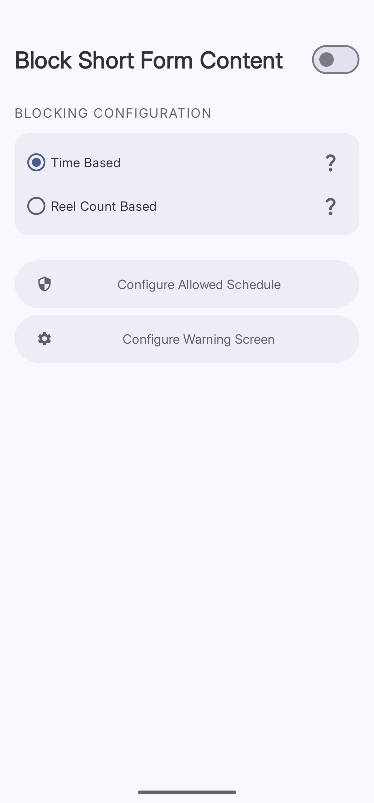

import { Steps, Aside } from '@astrojs/starlight/components';

**Block Short Form Content** stops you from scrolling through reels and shorts once you have reached a limit you set. You can choose a daily time total or a number of videos watched — whichever feels more meaningful to you.

## Supported Apps

Block Short Form Content works in these apps:

- Instagram (Reels)
- YouTube (Shorts)
- Facebook (Reels)

Curbox doesn't endorse any mod apps or illegal activities. These have been added by community members to the project.
- MyInsta
- Youtube ReVanced
- Morphe

btw if you kinda tech savy, you can easily add support for a new mod. Read [CONTRIBUTING.md](https://github.com/nethical6/curbox/)

## Blocking Modes

| Mode | How it works |
|---|---|
| **Time Based** | Tracks how long you spend watching short form videos each day. Blocks when you hit your time limit. |
| **Reel Count Based** | Counts how many short videos you watch. Blocks when you hit your count. |

<Aside type="note">
The count and time are combined across all supported apps. If you set a limit of 20 videos, watching 10 Reels on Instagram and 10 Shorts on YouTube counts as 20 total.
</Aside>

## Setting It Up

*Toggle the switch at the top right to turn the feature on, then choose your mode.*

<Steps>
1. **Open Short-Form Video Content**
   Tap **Reducers**, then tap **Short-Form Video Content**.

2. **Toggle the main switch on**
   The switch is at the top right of the **Block Short Form Content** screen.

3. **Choose a blocking mode**
   Select **Time Based** or **Reel Count Based**.

4. **Configure your schedule** (optional)
   Tap **Configure Allowed Schedule** to set the hours when the block is active.

5. **Configure the warning screen** (optional)
   Tap **Configure Warning Screen** to choose what happens when the block triggers. See [Unlock Challenges](BASE_URL/unlock-challenges/overview) for the full guide.
</Steps>

