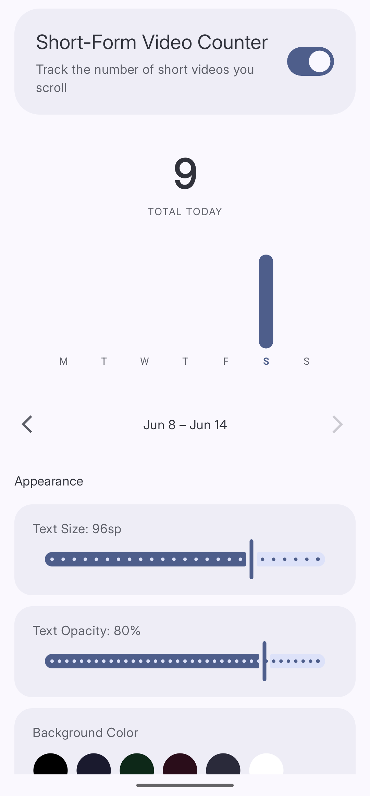

**Short-Form Video Counter** shows a number on your screen as you scroll through reels and shorts. Seeing the count climb in real time is a surprisingly honest way to stay aware of how much you are actually watching.

## Supported Apps

- Instagram (Reels)
- YouTube (Shorts)
- Facebook (Reels)

Curbox doesn't endorse any mod apps or illegal activities. These have been added by community members to the project.
- MyInsta
- Youtube ReVanced
- Morphe

## Enabling the Counter

Tap **Reducers**, then tap **Short-Form Video Counter**. Toggle on the switch at the top of the screen. The description reads "Track the number of short videos you scroll."

The counter is now live. It appears on screen whenever you scroll through a supported app.

## Reading Your Stats

*Today's total and your weekly trend — both visible on the same screen.*

The **Short-Form Video Counter** screen shows:

- **TOTAL TODAY** — how many short videos you have watched today
- **Weekly chart** — a bar for each day of the week so you can spot patterns over time

Use the arrows at the bottom of the chart to browse previous weeks.

## Appearance

Scroll down to the **Appearance** section to change how the counter looks on screen.

- **Text Size** — drag the slider to resize the counter
- **Text Opacity** — drag the slider to make it more or less visible
- **Background Color** — tap a color swatch to change the background behind the number
