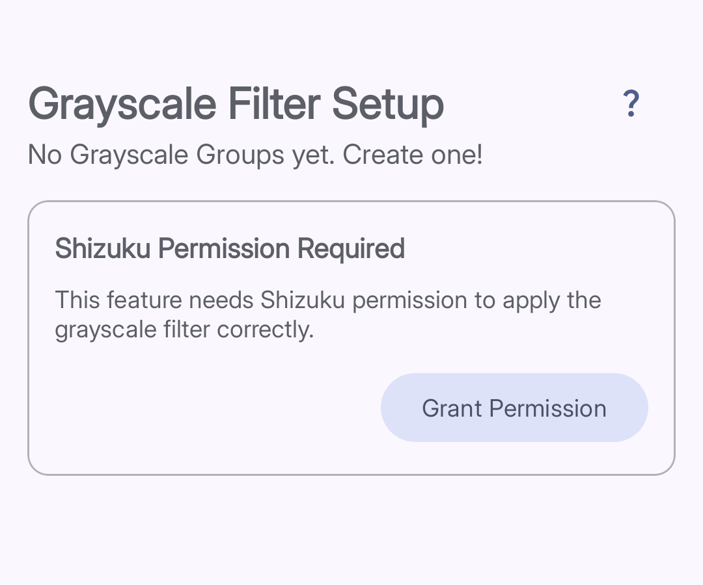

import { Steps, Aside } from '@astrojs/starlight/components';

**Grayscale Filter** turns your screen black and white when you open a chosen app. Color is one of the main reasons apps feel exciting and hard to put down — removing it makes them feel dull in a helpful way.

<Aside type="note">
Grayscale Filter requires a free helper app called Shizuku. You need to set up Shizuku before this feature will work.
</Aside>

## Setting Up Shizuku

*The Shizuku Permission Required card appears until you complete the setup below.*

Shizuku is a free Android app that gives Curbox the special permission needed to apply the grayscale effect.

<Steps>
1. **Install Shizuku**
   Download Shizuku from the Play Store or from its GitHub releases page.

2. **Activate Shizuku**
   Open Shizuku and follow its setup instructions. If you are on Android 11 or higher, you can activate it using Wireless Debugging — no computer needed.

3. **Grant permission to Curbox**
   Open Curbox, tap **Reducers**, then tap **Grayscale Filter**. You will see a **Shizuku Permission Required** card. Tap **Grant Permission** and approve the popup.
</Steps>

## Creating a Grayscale Group

Once Shizuku permission is granted, you can set up your groups.

<Steps>
1. **Tap the + button**
   The **+** button is in the bottom right corner of the **Grayscale Filter Setup** screen.

2. **Name your group**
   Type a name like "TikTok" or "Social Apps."

3. **Select apps**
   Choose the apps that should switch to grayscale when opened.

4. **Save**
   Tap **Done**. The filter is active for those apps immediately.
</Steps>
