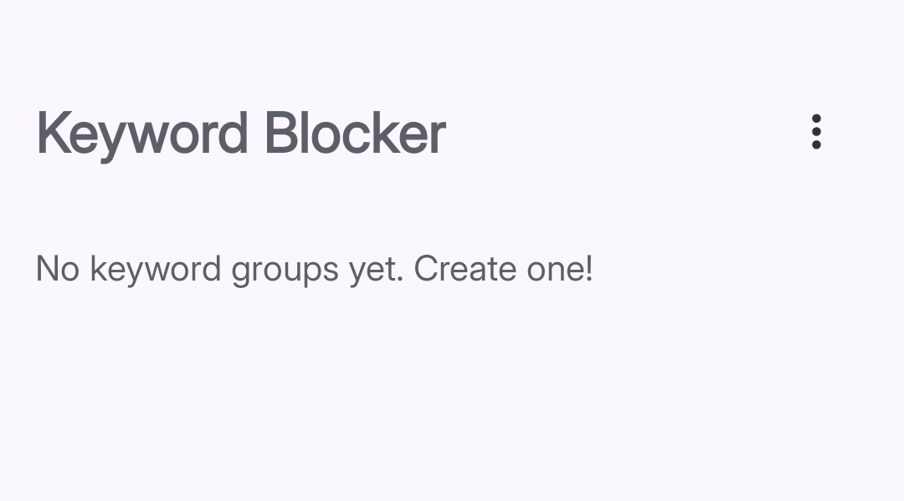

import { Steps, Aside } from '@astrojs/starlight/components';


**Keyword Blocker** watches the address bar in your browser. The moment you land on a page whose URL contains a word you have blocked, Curbox steps in with a pause screen.


## Supported Browsers

Keyword Blocker works in these browsers:

- Google Chrome
- Brave
- Firefox
- Fennec
- Opera
- Cromite
- Vanadium (GrapheneOS)

also if you're kinda pro, you can easily add support for a browser, especially if it's Chromium or Firefox based. Read [CONTRIBUTING.md](https://github.com/nethical6/curbox/)

<Aside type="note">
Keyword Blocker only works in the browsers listed above. If you use a different browser, the blocking will not apply there. Consider adding that browser to **App Pause** instead.
</Aside>


## Creating a Keyword Group


*Tap the + button to create your first keyword group.*

<Steps>
1. **Open Keyword Blocker**
   Tap **Reducers**, then tap **Keywords And Websites**.

2. **Tap the + button**
   The **+** button is in the bottom right corner.

3. **Enter a name**
   Give your group a name, like "Social Media Sites" or "News."

4. **Add keywords**
   Type the words or URL fragments you want to block. One keyword per entry.
   Scroll a few inches below on this page to learn how to write em properly.
5. **Configure the warning screen** (optional)
   Tap **Configure Warning Screen** to choose what happens when someone visits a blocked URL. See [Unlock Challenges](BASE_URL/unlock-challenges/overview).

6. **Save**
   Tap **Done**. The group is active immediately.
</Steps>


# How to Write Keywords

Keywords tell Curbox what websites or content to watch. When you visit something that matches a keyword, Curbox steps in based on the rules you set.

Here is everything you need to know to write keywords that actually work.

---

## The simplest way: just type the website name

If you want to block a whole website, just type its domain.

```
youtube.com
reddit.com
twitter.com
```

That is it. Curbox will block the site no matter what page you are on.

You do not need to add `https://` or `www.` — Curbox handles that for you.

---

## Block a specific section of a website

Maybe you only want to block YouTube Shorts, not all of YouTube.

Type the domain plus the path:

```
youtube.com/shorts
```

Now only Shorts get blocked. Regular YouTube videos are still allowed.

More examples:

```
instagram.com/reels
reddit.com/r/gaming
facebook.com/reel
```

---

## Block by path only (any website)

If you start a keyword with `/`, Curbox matches that path on any website.

```
/shorts
/reels
/reel
```

This blocks the `/shorts` path on YouTube, the `/reels` path on Instagram, and so on — all in one keyword.

---

## Use wildcards for flexible matching

A `*` means "anything can go here."

```
*.reddit.com
```

This matches `old.reddit.com`, `www.reddit.com`, `m.reddit.com` — any version of Reddit.

```
youtube.com/watch*
```

This matches any YouTube watch page, no matter what video ID comes after.

`?` works like `*` but matches exactly one character instead of many. You will rarely need this.

---

## Block by a single word

If you type just a plain word with no dots or slashes, Curbox looks for it as a piece of the domain name.

```
youtube
```

This matches `youtube.com`, `m.youtube.com`, `youtube.co.uk` — anything with `youtube` as a domain segment.

Useful when a site has many regional versions.

---

## Advanced: raw regex

If you know regular expressions, you can write one by starting the keyword with `r:`.

```
r:(?:shorts|reels|reel)
```

This matches any URL that contains the word `shorts`, `reels`, or `reel` anywhere in it.

Only use this if you are comfortable with regex. A typo will silently make the keyword do nothing.

---

## Importing a list from a file

You can add many keywords at once by importing a `.txt` file.

The file should have one keyword per line:

```
youtube.com/shorts
instagram.com/reels
/reel
tiktok.com
```

Blank lines are ignored. Duplicates are skipped automatically.

To import, open the keyword group, tap the three dot menu at the top, and choose **Import**.


<Aside type="tip">
Join our super pro [Discord Server](https://discord.com/invite/Vs9mwUtuCN) where you can request and download keyword lists
</Aside>


---

## Common mistakes

**Adding `https://` or `www.`**
You do not need these. `youtube.com` works the same as `https://www.youtube.com`.

**Being too broad**
`com` as a keyword would try to match every `.com` site. Keep keywords specific to what you actually want to block.

**Being too specific**
`youtube.com/shorts?v=abc123xyz` only blocks that one exact video. Use `youtube.com/shorts` instead to block all Shorts.

**Typos in regex**
If a keyword starts with `r:` and has a syntax error, it gets skipped silently. Test your regex before adding it.

---

## Quick reference

| What you want | What to type |
|---|---|
| Block a whole site | `youtube.com` |
| Block one section | `youtube.com/shorts` |
| Block a path on any site | `/shorts` |
| Block all subdomains | `*.youtube.com` |
| Block by domain word | `youtube` |
| Advanced match | `r:shorts\|reels` |


