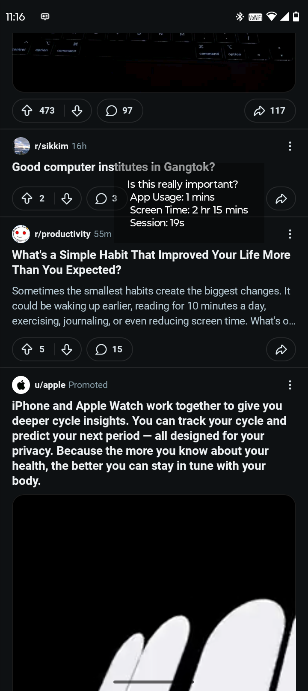
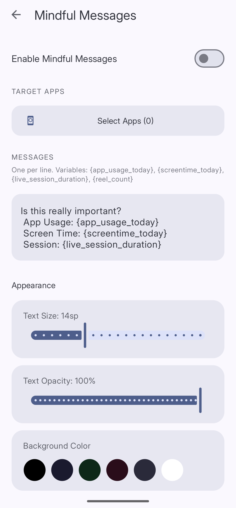

import { Steps, Aside } from '@astrojs/starlight/components';


**Mindful Messages** shows a message you wrote to yourself on top of the selected app the entire time you use it. You might write something like "Is this really important?" or "You wanted to read more instead." A moment of honest reflection can go a long way.

You find this feature under **Gentle Prompts** in the Reducers list.


*Write your message in the MESSAGES area. The placeholder variables update automatically each time the message appears.*

## Setting It Up


*Write your message in the MESSAGES area. The placeholder variables update automatically each time the message appears.*

<Steps>
1. **Open Gentle Prompts**
   Tap **Reducers**, then tap **Gentle Prompts**.

2. **Toggle on Enable Mindful Messages**
   The switch is at the top of the **Mindful Messages** screen.

3. **Select target apps**
   Tap **Select Apps** and choose which apps should show the message when opened.

4. **Write your message**
   In the **MESSAGES** section, type your message in the text area. Write one message per line. Each line is shown separately on the overlay.

5. **Add placeholders** (optional)
   Insert variables from the table below to make the message personal and specific to the moment you are in.
</Steps>


## Placeholders

| Placeholder | What it shows |
|---|---|
| `{app_usage_today}` | Time spent in this app today |
| `{screentime_today}` | Total screen time across all apps today |
| `{live_session_duration}` | How long you have been in this app continuously right now |
| `{reel_count}` | How many short form videos you have watched today |

Example message:

```
Is this really important?
App Usage: {app_usage_today}
Screen Time: {screentime_today}
Session: {live_session_duration}
```


## Appearance

Scroll down to the **Appearance** section to change how the overlay looks.

- **Text Size** — drag the slider to make the text larger or smaller
- **Text Opacity** — drag the slider to make the text more or less visible
- **Background Color** — tap a color swatch to change the overlay background

<Aside type="tip">
A dark background with large text tends to be the most noticeable without feeling harsh. Start with black and adjust from there.
</Aside>
