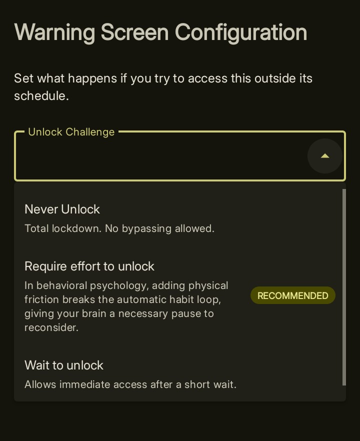

import { Steps, Aside, Tabs, TabItem } from '@astrojs/starlight/components';

When a block triggers in Curbox, a pause screen appears. **Warning Screen** control what happens on that screen whether you can get past it, how hard that is, and how long it takes.

You set the challenge inside each App Pause or Short-Form Video group by tapping **Configure Warning Screen**.

## When this screen is shown?
This screen gets triggered when you try accessing an app out of its schedule.
For example, if i've set the blocking mode to Time based with an allowed schedule between 2 pm to 6pm everyday. This screen won't show up if i access the app between 2pm
to 9pm. If i try to access the apps in this group anytime other than the schedule, this screen decides what has to be done.

<Aside type="note">
In case of "on each open" mode, this screen will be triggered every time you open the app. 
</Aside>

## Choosing a Challenge Type

The **Warning Screen Configuration** screen has one main setting: the **Unlock Challenge** dropdown. There are three options.

<Aside type="tip">
**Require effort to unlock** is the recommended choice for most people. Adding a small task breaks the automatic habit loop and gives your brain a moment to make a real decision.
</Aside>

<Tabs>
  <TabItem label="Never Unlock">
    **Never Unlock** turns the block into a total lockdown. The pause screen shows no way past it.

    Use this when you want to make an app completely off-limits with no exceptions — no loopholes, no "just this once."
  </TabItem>
  <TabItem label="Require Effort">
    **Require effort to unlock** adds a task you must complete before the proceed button appears. There are three effort types to choose from:

    - **QR or Barcode Scan** — you must scan a specific QR code you set up in advance. Putting the code on a shelf in another room makes it genuinely inconvenient.
        <Aside type="tip"> Curbox doesn't necessarily require you to print a new qr/barcode code. You can simply take a product box with a qr, and configure curbox to work with it. Its highly recommended you disperse this qr code away from the usual place you scroll.</Aside>
        <Aside type="tip"> You can set a QR code to unlock scrolling time. It can either grant a pre-set amount of time (like 10 minutes) or let you pick the time right when you scan it.</Aside>
    
    - **Type a Sentence** — you must type a sentence exactly as written. The deliberate act of typing creates a natural pause.
    - **State Your Intent** — you must type what you plan to do in the app. Your reason is saved so you can review it later.

  </TabItem>
  <TabItem label="Wait to unlock">
    **Requires no effort to unlock** makes you wait before the proceed button appears, but no task is required.

    Two timing options are available:

    - **Fixed time** — the wait is always the same number of seconds.
    - **Dynamic time** — the wait changes each time, so you cannot predict how long it will be.
  </TabItem>
</Tabs>

## The Delay Timer

Whatever challenge type you choose, you can add a countdown before the challenge even appears. During the countdown, your screen brightens and your phone vibrates — a physical reminder that you are about to make a choice.

<Aside type="tip">
Even a 10 second delay is often enough. That brief pause interrupts autopilot and gives you the chance to ask whether you really want to open the app.
</Aside>

# Advanced

## Proceed Limits

You can cap how many times you are allowed to proceed through a block within a given time window. Once you hit the cap, the proceed button disappears until the window resets.

## Custom Message
You can setup a message that appears when you open a blocked entity. Combining this together with delay timer, forces you to think before you mindlessly starts scrolling.
Examples of a good custom messages:
- Are you truly giving up your dreams to scroll 5 mins?
- That 5 mins costs you a 100 days in 5 years btw